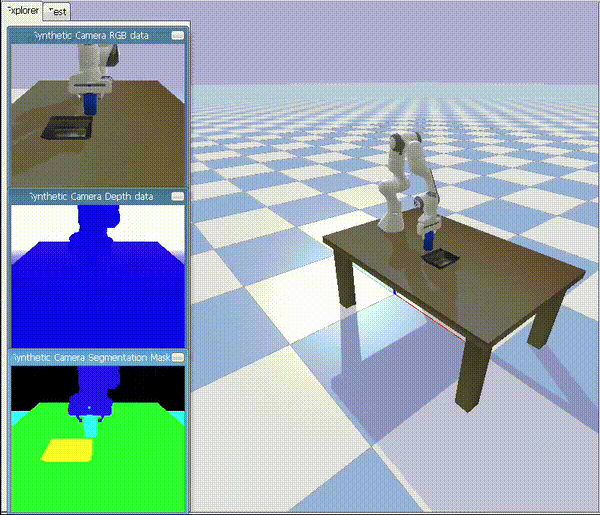
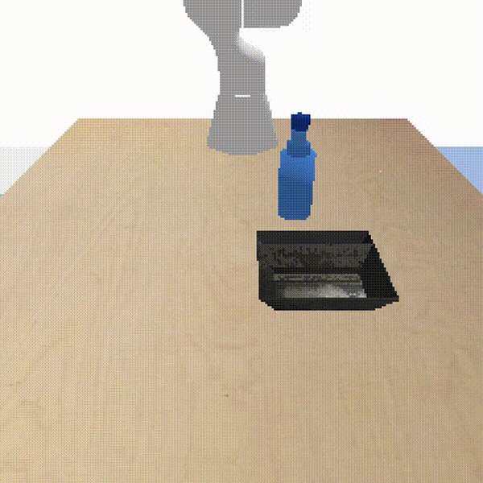

# vla-grasp
OpenVLA-based grasping in a custom PyBullet environment

Physical AI and vision-language-action (VLA) models are becoming a core part of modern robotics, and this repo is a hands-on exploration of the idea. Instead of using one of OpenVLA's existing benchmark environments, this builds a custom PyBullet environment and uses it to teach a Franka Panda arm to pick up a water bottle and place it on a tray.

*This is a proof-of-concept, intended as a learning project for understanding VLA fine-tuning in practice, not a production-ready grasping system.*


## Demonstration

<p align="center">
    
    </br>
    <sup>Expert Policy</sup>
</p>

<p align="center">
    
    </br>
    <sup>Fine-tuned Rollout Policy</sup>
</p>


## Pipeline
Collect demonstrations autonomously in the custom environment, fine-tune OpenVLA on that data, and evaluate the resulting policy closed-loop in that environment. The base OpenVLA model doesn't work here out of the box because it's a vision model trained on a specific visual distribution (mainly on real-world data), and robot mesh puts this scene out of that distribution. Fine-tuning brings the model in-distribution for it.


## Files

| File                                                           | Purpose                                                                  |
|----------------------------------------------------------------|--------------------------------------------------------------------------|
| `pick_place_env.py`                                            | PyBullet environment (`PickPlaceEnv`) and scripted `ExpertPolicy`        |
| `assets/bottle.urdf`                                           | Water-bottle proxy (graspable cylinder body with visual neck/cap)        |
| `collect_demos.py`                                             | Runs the expert policy and saves successful demos to `demos/*.npz`       |
| `bottle_dataset.py`                                            | Custom PyTorch `Dataset` over the demos, with action normalization       |
| `finetune_bottle.py`                                           | Single-GPU 4-bit QLoRA fine-tuning script                                |
| `deploy_finetuned.py`                                          | Loads the fine-tuned checkpoint and runs closed-loop evaluation          |
| `demo_to_video.py`                                             | Converts a `demos/episode_XXXX.npz` file to an MP4                       |
| `runs/openvla-7b+pybullet_bottle+b16+lr0.0005+lora-r32+q4bit/` | Fine-tuned merged bf16 checkpoint (~14 GB) and `dataset_statistics.json` |


## Environment

`pick_place_env.py` sets up a Franka Panda arm (`franka_panda/panda.urdf`) at a table (`table/table.urdf`) with a tray (`tray/tray.urdf`) and a bottle (`assets/bottle.urdf`).

- A fixed third-person camera renders 224x224 RGB frames, matching OpenVLA's expected input resolution, identically at train and deploy time.
- The action space is 7-dimensional to match OpenVLA: `[dx, dy, dz, droll, dpitch, dyaw, gripper]`. `dx/dy/dz` are end-effector position deltas in world coordinates, applied via inverse kinematics with a fixed top-down orientation; rotations are kept zero. Gripper is in `[-1, 1]`, where +1 is open and -1 is closed.
- The bottle and tray are placed randomly within a 0.30 x 0.30 m reachable region around the table center.
- An episode counts as a success if the bottle ends up within the tray, resting low, with the gripper open.

The scripted `ExpertPolicy` uses privileged state to compute the 7-DoF deltas: align above the bottle, descend, close the gripper, lift, move over the tray, descend, release.


## Hardware

Fine-tuning was done on a single NVIDIA GPU RTX 4090, using 4-bit QLoRA, which kept training under ~15 GB of VRAM.


## Data collection

```bash
python collect_demos.py --n 100
```

Collects 100 successful episodes and saves them to `demos/episode_XXXX.npz`. Failed episodes are dropped automatically and collection continues until the target count is reached.


## Dataset preparation

Rather than building an RLDS/TFDS dataset and registering it in OpenVLA's Open X-Embodiment data pipeline, this uses OpenVLA's simpler custom PyTorch Dataset hook (see the `DummyDataset` block in `vla-scripts/finetune.py` in the OpenVLA source). The custom dataset, `BottleDataset` in `bottle_dataset.py`:

- Loads all demos into memory and yields the dict OpenVLA expects: `{pixel_values, input_ids, labels}`.
- Normalizes actions per-dimension using `q01`/`q99` bounds, mapping them to `[-1, 1]` before tokenizing; constant dimensions (rotations) map to 0. The same statistics are saved to `dataset_statistics.json` for un-normalizing actions at inference.
- Applies no image augmentation (no center-crop), so deployment doesn't crop either.


## Fine-tuning

Adapted from OpenVLA's `finetune.py`, this saves a merged checkpoint to disk:

```bash
python finetune_bottle.py --batch_size 4 --grad_accumulation_steps 4 \
    --max_steps 1000 --save_steps 500 --num_workers 0
```

Training loss drops from about 10.5 to under 1 within first few steps, and action-token accuracy reaches roughly 80% early on. The full run took about 3 hours.


## Deploy and evaluation

```bash
python deploy_finetuned.py --episodes 20
```

Loads the fine-tuned checkpoint, sets `model.norm_stats` from `dataset_statistics.json`, and runs the policy closed-loop in `PickPlaceEnv`, predicting and executing an action at each step. A rollout video is saved to `videos/finetuned_rollout.mp4`.


## References

- Custom dataset hook: `DummyDataset` block in `vla-scripts/finetune.py`
- Action tokenizer: `prismatic/vla/action_tokenizer.py`
- Statistics save/load: `prismatic/vla/datasets/rlds/utils/data_utils.py`
